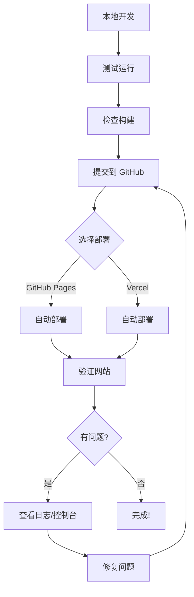

# 禅意厨房项目踩坑记录

这是 ZenKitchen（禅意厨房）从零到上线的完整踩坑与解决方案记录。记录了与 Claude Code 和 Gemini AI 协作开发过程中遇到的所有问题。

---

## 目录
1. [初始运行问题](#1-初始运行问题)
2. [API 配置问题](#2-api-配置问题)
3. [GitHub 仓库"幻觉"问题](#3-github-仓库幻觉问题)
4. [Vercel 部署空白页问题](#4-vercel-部署空白页问题)
5. [GitHub Pages 部署失败](#5-github-pages-部署失败)
6. [GitHub Pages 空白页问题](#6-github-pages-空白页问题)
7. [经验总结](#经验总结)

---

## 1. 初始运行问题

### 问题描述
打开 `index.html` 文件是空的，网页无法加载。

### 错误现象
- 浏览器显示空白页面
- 没有任何内容显示

### 根本原因
1. **依赖未安装**：项目的 `node_modules` 文件夹不存在
2. **缺少 CSS 文件**：`index.html` 引用了 `index.css`，但文件不存在
3. **运行方式错误**：这是一个 Vite + React 项目，不能直接打开 HTML 文件

### 解决方案

**步骤 1：安装依赖**
```bash
npm install
```

**步骤 2：创建缺失的 index.css**
```css
/* ZenKitchen 禅意厨房 - Global Styles */
* {
  margin: 0;
  padding: 0;
  box-sizing: border-box;
}

body {
  font-family: 'Inter', system-ui, -apple-system, 'Segoe UI', 'Roboto';
  background-color: #f6f1eb;
  color: #333;
  line-height: 1.6;
}
/* ... 更多样式 ... */
```

**步骤 3：启动开发服务器**
```bash
npm run dev
```

**步骤 4：访问本地服务器**
```
http://localhost:3000
```

### 经验教训
- ✅ Vite 项目必须通过开发服务器运行，不能直接打开 HTML
- ✅ 始终检查项目依赖是否已安装
- ✅ 检查所有引用的文件是否存在

---

## 2. API 配置问题

### 问题描述
点击"编译菜谱"按钮后提示错误："编译菜谱失败。请检查网络连接或稍后重试。"

### 错误现象
```
编译菜谱失败。请检查网络连接或稍后重试。
```

### 根本原因
`.env.local` 文件中的 Gemini API Key 是占位符：
```
GEMINI_API_KEY=PLACEHOLDER_API_KEY
```

### 解决方案

**步骤 1：获取真实 API Key**
访问 [Google AI Studio](https://aistudio.google.com/apikey) 获取免费的 Gemini API Key

**步骤 2：配置 API Key**
编辑 `.env.local` 文件：
```
GEMINI_API_KEY=AIzaSy真实的API密钥
```

**步骤 3：重启开发服务器**
```bash
# 停止当前服务器 (Ctrl+C)
npm run dev
```

### 为什么需要 API Key？
- 应用使用 Google Gemini AI 来生成和改良菜谱
- Gemini API 需要身份验证
- 免费层级足够个人使用

### 经验教训
- ✅ 永远不要在代码中硬编码 API Key
- ✅ 使用环境变量管理敏感信息
- ✅ `.env.local` 已在 `.gitignore` 中，不会泄露到 GitHub

---

## 3. GitHub 仓库"幻觉"问题

### 问题描述
应用声称"从 GitHub 开源库检索菜谱"，但实际上 AI 只是基于记忆"编造"内容。

### 错误现象
- UI 显示："AI 正在检索 GitHub 开源库并进行健康重构"
- 实际上没有任何网络请求到 GitHub
- 生成的菜谱可能不基于真实的开源项目

### 根本原因
原始代码只是通过提示词让 AI 假装访问 GitHub：

```typescript
// ❌ 错误的实现
contents: `请搜索你知识库中 'HowToCook' 或 '老乡鸡' 相关的经典做法`
```

这是典型的 AI "幻觉"（Hallucination）：
- AI 从训练数据中回忆相关内容
- 如果训练数据中没有，就会编造
- 无法保证真实性和准确性

### 解决方案

**步骤 1：创建 GitHub 数据获取服务**

创建 `services/githubService.ts`：

```typescript
const GITHUB_RAW_BASE = 'https://raw.githubusercontent.com';

// 真实的仓库配置
const REPOS = {
  HowToCook: {
    owner: 'Anduin2017',
    repo: 'HowToCook',
  },
  CookLikeHOC: {
    owner: 'Gar-b-age',
    repo: 'CookLikeHOC',
  }
};

// 真实获取 GitHub 文件
export async function fetchRecipeFromGitHub(
  repo: 'HowToCook' | 'CookLikeHOC',
  filePath: string
): Promise<RecipeSource> {
  const url = `${GITHUB_RAW_BASE}/${owner}/${repo}/main/${filePath}`;
  const response = await fetch(url);
  const content = await response.text();
  return { repo, path: filePath, content, url };
}
```

**步骤 2：集成真实数据到 AI**

修改 `services/geminiService.ts`：

```typescript
// ✅ 正确的实现
export const generateRecipeFromIngredients = async (ingredients: string) => {
  // 1. 真实获取 GitHub 菜谱
  const githubRecipes = await searchRecipesByIngredients(ingredients, 3);

  // 2. 将真实内容传递给 AI
  const recipeContext = githubRecipes.map(recipe => `
    ### 参考食谱 (来自 ${recipe.repo})
    来源: ${recipe.url}
    内容: ${recipe.content}
  `).join('\n');

  // 3. AI 基于真实数据进行改良
  const response = await ai.models.generateContent({
    contents: `我已经从 GitHub 获取到真实菜谱：\n${recipeContext}\n请基于这些真实内容进行改良`
  });
};
```

**步骤 3：更新 UI 文案**

修改 `App.tsx`，确保文案准确：

```typescript
// ❌ 误导性文案
<p>AI 正在检索 GitHub 开源库并进行健康重构</p>

// ✅ 准确文案
<p>正在从 HowToCook 和 CookLikeHOC 仓库获取真实菜谱</p>
<p>Fetching: github.com/Anduin2017/HowToCook</p>
<p>Fetching: github.com/Gar-b-age/CookLikeHOC</p>
```

### 验证方法

1. 打开浏览器开发者工具（F12）
2. 切换到 Network（网络）标签
3. 点击"生成菜谱"
4. 应该看到真实的请求到：
   ```
   https://raw.githubusercontent.com/Anduin2017/HowToCook/...
   https://raw.githubusercontent.com/Gar-b-age/CookLikeHOC/...
   ```

### 真实数据来源

**HowToCook 仓库**
- URL: https://github.com/Anduin2017/HowToCook
- Stars: 62K+
- 内容：程序员做饭指南，精确的量化标准

**CookLikeHOC 仓库**
- URL: https://github.com/Gar-b-age/CookLikeHOC
- 内容：老乡鸡菜品溯源报告整理

### 经验教训
- ✅ **永远验证 AI 的声明**：如果 AI 说它在"搜索"或"访问"，检查是否有真实的网络请求
- ✅ **提示词 ≠ 真实行为**：提示词只是让 AI 假装，不是真的执行
- ✅ **代码胜于承诺**：查看实际代码实现，而不是相信描述
- ✅ **可追溯性**：真实数据应该有明确的来源 URL

---

## 4. Vercel 部署空白页问题

### 问题描述
部署到 Vercel 后，打开网站显示空白页面。

### 错误现象
- Vercel 部署成功（绿色勾）
- 访问 URL 显示空白页
- 浏览器控制台可能有 JavaScript 错误

### 根本原因

**原因 1：缺少 Vercel 配置文件**
Vercel 不知道如何构建 Vite 项目

**原因 2：环境变量未配置**
API Key 在服务器端不存在

**原因 3：SPA 路由问题**
Vercel 默认不支持单页应用的路由重写

### 解决方案

**步骤 1：创建 vercel.json**

```json
{
  "buildCommand": "npm run build",
  "outputDirectory": "dist",
  "framework": "vite",
  "rewrites": [
    {
      "source": "/(.*)",
      "destination": "/index.html"
    }
  ]
}
```

**步骤 2：支持多种 API Key 来源**

修改 `vite.config.ts`：

```typescript
const apiKey = env.GEMINI_API_KEY || env.VITE_GEMINI_API_KEY || '';
```

**步骤 3：添加用户 API Key 输入**

创建 `components/ApiKeyInput.tsx`，让用户可以输入自己的 API Key：

```typescript
const ApiKeyInput = ({ onApiKeySet }) => {
  const [apiKey, setApiKey] = useState('');

  const handleSubmit = (e) => {
    e.preventDefault();
    localStorage.setItem('zenkitchen_api_key', apiKey);
    onApiKeySet(apiKey);
  };

  return (
    <form onSubmit={handleSubmit}>
      <input type="password" value={apiKey} onChange={...} />
      <button type="submit">保存并开始使用</button>
    </form>
  );
};
```

**步骤 4：在 Vercel 配置环境变量（可选）**

1. 访问 Vercel Dashboard
2. 进入项目 Settings → Environment Variables
3. 添加：
   ```
   GEMINI_API_KEY = 你的API密钥
   ```
   或
   ```
   VITE_GEMINI_API_KEY = 你的API密钥
   ```

### 两种部署模式

**模式 1：配置服务器端 API Key**
- 所有用户使用同一个 API Key
- 需在 Vercel 配置环境变量
- 适合个人使用或信任的用户群

**模式 2：用户自带 API Key**
- 每个用户输入自己的 API Key
- 存储在浏览器 localStorage
- 更安全，成本分散

### 经验教训
- ✅ 不同平台需要不同配置（Vercel vs GitHub Pages）
- ✅ 环境变量命名可能有平台特定要求（VITE_ 前缀）
- ✅ 提供多种 API Key 配置方式，提高灵活性
- ✅ 用户输入 API Key 是一个好的备用方案

---

## 5. GitHub Pages 部署失败

### 问题描述
GitHub Actions 工作流运行失败，错误信息：
```
Error: Failed to create deployment (status: 404)
Ensure GitHub Pages has been enabled
```

### 错误现象
- GitHub Actions 显示红色 ❌
- deploy 步骤失败
- 错误日志提示 404 Not Found

### 根本原因
**GitHub Pages 功能未启用**

虽然创建了 `.github/workflows/deploy.yml` 工作流，但 GitHub Pages 需要手动在仓库设置中启用。

### 解决方案

**步骤 1：启用 GitHub Pages**

1. 访问：`https://github.com/你的用户名/ai-recipe/settings/pages`
2. 在 **Source** 下拉菜单中选择 **"GitHub Actions"**
3. 页面会自动保存

**步骤 2：重新触发部署**

```bash
git commit --allow-empty -m "Trigger GitHub Pages deployment"
git push
```

**步骤 3：等待部署完成**

访问 `https://github.com/你的用户名/ai-recipe/actions` 查看进度

### 为什么需要手动启用？

出于安全考虑，GitHub 不允许通过 API 自动启用 Pages。这防止了：
- 恶意代码自动公开部署
- 未经授权的公开内容
- 意外的资源消耗

### 经验教训
- ✅ GitHub Pages 首次使用需要手动启用
- ✅ 仔细阅读错误信息，通常会给出解决提示
- ✅ 部署失败时检查仓库 Settings

---

## 6. GitHub Pages 空白页问题

### 问题描述
GitHub Pages 部署成功（绿色勾），但访问网站仍然显示空白页。

### 错误现象
- GitHub Actions 显示成功 ✅
- 访问 `https://用户名.github.io/ai-recipe/` 空白
- 浏览器控制台可能显示 404 错误

### 根本原因

**base 路径配置错误**

GitHub Pages 将项目部署到子目录：
```
https://用户名.github.io/ai-recipe/
                            ^^^^^^^^^^
                            子目录路径
```

但 `vite.config.ts` 中配置的是根路径：
```typescript
base: '/'  // ❌ 错误
```

导致资源加载路径错误：
```html
<!-- 实际生成的路径（错误） -->
<script src="/assets/index-xxx.js"></script>

<!-- 应该是 -->
<script src="/ai-recipe/assets/index-xxx.js"></script>
```

### 解决方案

**修改 vite.config.ts**

```typescript
export default defineConfig({
  base: '/ai-recipe/'  // ✅ 正确：仓库名作为 base 路径
});
```

**提交并推送**

```bash
git add vite.config.ts
git commit -m "Fix GitHub Pages base path"
git push
```

### 验证方法

**方法 1：检查 HTML 源代码**

访问网站，右键 → 查看源代码，检查资源路径：

```html
<!-- ✅ 正确 -->
<script src="/ai-recipe/assets/index-xxx.js"></script>
<link href="/ai-recipe/assets/index-xxx.css">

<!-- ❌ 错误 -->
<script src="/assets/index-xxx.js"></script>
```

**方法 2：检查浏览器控制台（F12）**

看是否有 404 错误：
```
GET https://用户名.github.io/assets/index-xxx.js 404 (Not Found)
```

### 不同部署场景的 base 配置

```typescript
// 根域名部署（如 Vercel）
base: '/'

// GitHub Pages 子目录
base: '/仓库名/'

// 自定义域名
base: '/'
```

### 经验教训
- ✅ **不同部署平台路径不同**：Vercel 根路径 vs GitHub Pages 子目录
- ✅ **检查构建输出**：确认资源路径是否正确
- ✅ **测试两种场景**：本地开发和生产部署可能不同
- ✅ **使用条件配置**：可以根据环境变量自动切换 base 路径

---

## 经验总结

### 开发流程最佳实践

1. **本地先测试**
   ```bash
   npm install
   npm run dev    # 开发环境
   npm run build  # 测试构建
   npm run preview # 预览生产版本
   ```

2. **检查清单**
   - [ ] 依赖已安装
   - [ ] 环境变量已配置
   - [ ] 本地运行正常
   - [ ] 构建成功无错误
   - [ ] 预览版本正常

3. **部署前准备**
   - [ ] 敏感信息在 `.gitignore`
   - [ ] 创建 `.env.example` 模板
   - [ ] 更新 README 部署说明
   - [ ] 配置正确的 base 路径

### AI 协作的经验教训

1. **验证 AI 的声明**
   - AI 说"搜索 GitHub"？检查是否有真实请求
   - 看代码实现，不只看描述
   - 使用浏览器开发者工具验证

2. **提示词工程的局限**
   - 提示词不等于真实行为
   - "假装"访问 ≠ 真实访问
   - 需要编写真实的 API 调用代码

3. **多 AI 协作**
   - Claude Code：架构和代码实现
   - Gemini：内容生成和改良
   - 各司其职，发挥优势

### 部署平台选择

| 平台 | 优点 | 缺点 | 适用场景 |
|------|------|------|----------|
| **GitHub Pages** | 免费、自动部署、HTTPS | 静态网站、子目录路径 | 开源项目、个人作品集 |
| **Vercel** | 速度快、CDN、易配置 | 免费版有限制 | 个人项目、小型应用 |
| **本地开发** | 完全控制、快速迭代 | 需要自己运行 | 开发调试 |

### 调试技巧

1. **浏览器开发者工具（F12）**
   - Console：查看错误日志
   - Network：检查网络请求
   - Application：查看 localStorage

2. **Git 历史**
   ```bash
   git log --oneline  # 查看提交历史
   git diff           # 查看改动
   git status         # 检查状态
   ```

3. **逐步排查**
   - 先本地运行 ✓
   - 再构建测试 ✓
   - 最后部署上线 ✓

### 文档的重要性

在这个项目中创建的文档：
- `README.md` - 项目介绍
- `DEPLOYMENT.md` - 部署指南
- `TROUBLESHOOTING.md` - 本文档
- `.env.example` - 配置模板

**好的文档能节省 80% 的时间！**

### 最终工作流程



---

## 快速问题诊断表

遇到问题时，按此顺序检查：

| 问题 | 检查项 | 解决方案 |
|------|--------|----------|
| 本地空白页 | ✓ 依赖安装 <br> ✓ 开发服务器运行 | `npm install && npm run dev` |
| API 错误 | ✓ `.env.local` 存在 <br> ✓ API Key 正确 | 获取真实 API Key |
| 部署失败 | ✓ 工作流配置 <br> ✓ Pages 启用 | 检查 GitHub Actions 日志 |
| 线上空白页 | ✓ base 路径 <br> ✓ 资源加载 | 修复 `vite.config.ts` |
| 功能不工作 | ✓ 控制台错误 <br> ✓ 网络请求 | F12 开发者工具 |

---

## 相关资源

- [Vite 官方文档](https://vitejs.dev/)
- [GitHub Pages 文档](https://docs.github.com/pages)
- [Vercel 文档](https://vercel.com/docs)
- [Google Gemini API](https://aistudio.google.com/apikey)
- [HowToCook 仓库](https://github.com/Anduin2017/HowToCook)
- [CookLikeHOC 仓库](https://github.com/Gar-b-age/CookLikeHOC)

---

**记住：每个错误都是学习的机会。这份文档记录了真实的开发过程，希望能帮助其他人避免同样的坑！** 🚀

*最后更新：2025-01-26*
